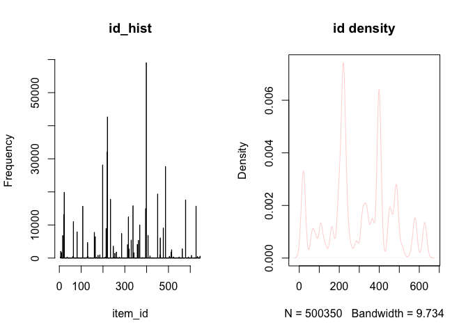
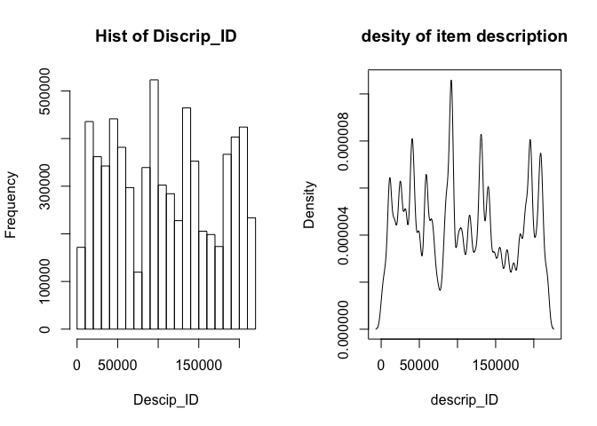

# taobao_info
xvshiting  
2015年9月28日  
##DATA ACCESS


```r
item<-read.table("dim_items.txt",header = FALSE)
match.taobao<-read.table("dim_fashion_matchsets.txt",header = FALSE)
```

##Data Analysis

商品类型一共有`283`种,编号最小为5，最大为646.每种所占数量如下图：

 

对于商品的描述（切词）共有`85082`种，最小值为`1`最大值为`219179`.分布图 和概率密度图：

 
